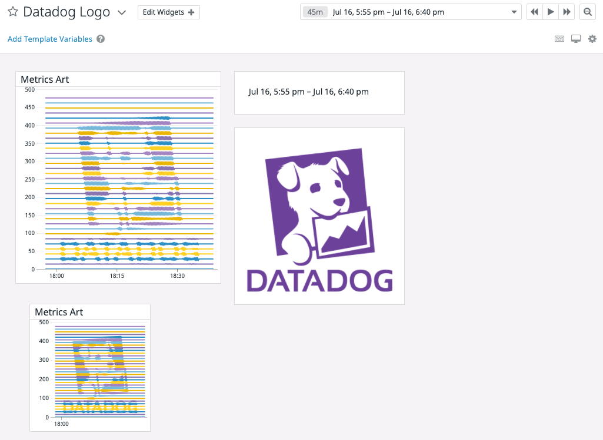
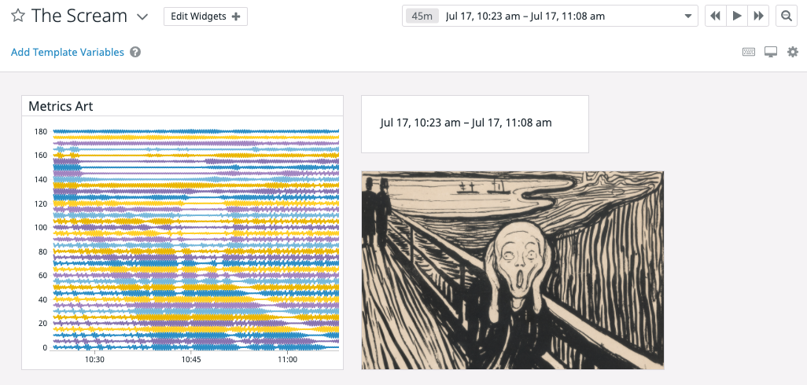

# MetricArt

A short script to turn an image into timeseries data that can be graphed.

Can be run like `python3 img_proc.py --preview my_image.png` to preview the graph with matplotlib before sending it to Datadog or without the `--preview` flag to start sending metrics to DD.

## Examples

